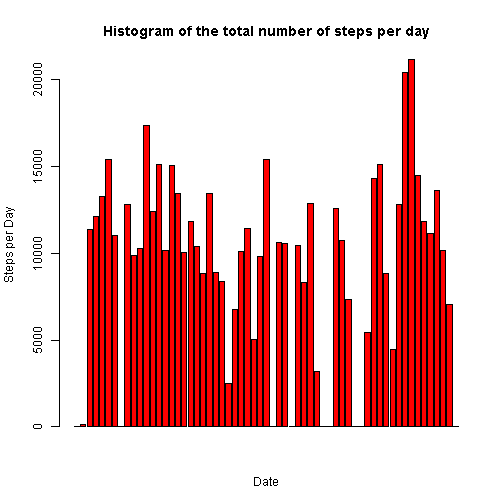
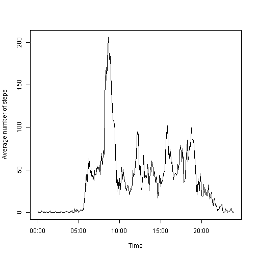
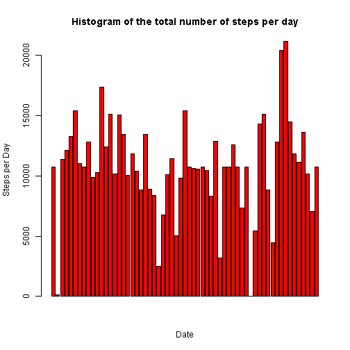
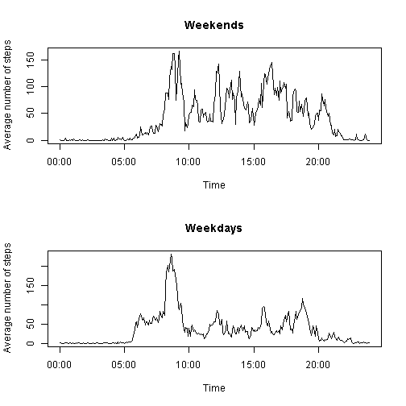

# This file is for the first Peer Assesment of Reproducible Research - Coursera

=======================================================================

## Part 1: loading and processing the data

Load the data


```r
actData <- read.csv("activity.csv")
```

Reformat the date


```r
actData$date <- as.Date(actData$date)
```
======================================================================

## Part 2: calculate the mean total number of steps taken per day

In this section, we find the mean total number of steps taken per day. The missing values in the dataset is ignored.

Find the unique dates in the dataset

```r
uniDate <- unique(actData$date)
```

Create a dataframe with the unique dates as a column


```r
totalStep <- data.frame( sumStep = numeric(length(uniDate)), date = uniDate )
```

Calculate the total number of steps taken per day


```r
for (i in 1:length(uniDate)){
    tmp <- actData[actData$date == totalStep$date[i],]    # select on the i-th date
    
    # Test: if the there is no recored number for steps then assign NA to the sum. Otherwise, remove the NA from steps and calculate the sum.
    if ( length(tmp[!is.na(tmp$steps),]$date) ==0 ) {
        totalStep$sumStep[i] <- NA
    } else{
        totalStep$sumStep[i] <- sum(tmp$steps, na.rm = TRUE)
    }
}
```

Make a histogram of the total number of steps taken each day


```r
# Obtain a clean set without any NA in the total number of steps
ttStepRmNA <- totalStep
ttStepRmNA[is.na(totalStep$sumStep),]$sumStep <- 0

# Plot the histogram with barplot function
barplot(ttStepRmNA$sumStep, col = "red", xlab="Date", ylab="Steps per Day", main = "Histogram of the total number of steps per day")
```

 

Calculate the mean and median 


```r
meanStep <- mean(totalStep$sumStep, na.rm = TRUE)
medianStep <- median(totalStep$sumStep, na.rm = TRUE)
```

The mean and median of the total number of steps taken per day are 1.0766189 &times; 10<sup>4</sup> and 1.0765 &times; 10<sup>4</sup>, respectively.

=======================================================================

## Part 3: calculate the average daily activity pattern

Find how many 5-minute interval


```r
tmp <- actData[actData$date == "2012-10-01",]
num5int <- length(tmp$date)
num5int
```

```
## [1] 288
```

Since num5int = 288, we will generate a 5-min interval vector with a conventional format for later plots.


```r
int5min <- format( seq.POSIXt(as.POSIXct(Sys.Date()), as.POSIXct(Sys.Date()+1), by = "5 min"), "%H:%M", tz="GMT")
int5min <- int5min[1:288]

int5minDayInc <- as.POSIXct(int5min, format="%H:%M")
```

Create a dataframe containing the average steps taken for each interval


```r
avgStep5int <- data.frame(avgStep = numeric(length(unique(actData$interval))), interval = unique(actData$interval))
```

For each 5-min interval, calculate the average across all the days and fill in "avgStep5int". Note that we do not assign 0 to the NA values but simply do not count them.

Two wrong approaches are: (1) assign 0 to the NA values then take the mean, and (2) take the sum over all values, ignoring the mean, but then divide this sum over the vector length which still counts NA as one element.


```r
for (i in unique(actData$interval)){
    tmp = actData[actData$interval == i,]
    
    avgStep5int$avgStep[avgStep5int$interval == i] <- mean(tmp$steps, na.rm = TRUE)
}
```

Make a time series plot


```r
plot(int5minDayInc, avgStep5int$avgStep, type = "l", xlab = "Time", ylab = "Average number of steps")
```

 

Find the interval with the maximum number of steps


```r
ind <- which.max(avgStep5int$avgStep)
max(avgStep5int$avgStep)
```

```
## [1] 206.1698
```

The interval with the maximum number of steps is 08:35.

======================================================================

## Part 4: imputing missing values

Calculate the total number of missing values in the dataset


```r
ind <- which(is.na(actData$steps), arr.ind=TRUE)
numRowNA <- length(ind)
```

The number of rows with NAs is 2304.

We will fill in all of the missing values in the dataset. Here the missing values are filled in with the mean of that 5-min interval.


```r
impActData <- actData

for (i in ind){
    tmpInd <- avgStep5int$interval == impActData$interval[i]
    impActData$steps[i] <- avgStep5int$avgStep[tmpInd]
}
```

The new data set is "impActData".

Make a histogram of the total number of steps taken each day for the new data set


```r
impTotalStep <- data.frame( sumStep = numeric(length(uniDate)), date = uniDate )

for (i in 1:length(uniDate)){
    tmp <- impActData[impActData$date == impTotalStep$date[i],]    # select on the i-th date

    impTotalStep$sumStep[i] <- sum(tmp$steps, na.rm = TRUE)
}

# Plott the histogram with barplot function
barplot(impTotalStep$sumStep, col = "red", xlab="Date", ylab="Steps per Day", main = "Histogram of the total number of steps per day")
```

 

Calculate the mean and median 


```r
impMeanStep <- mean(impTotalStep$sumStep, na.rm = TRUE)
impMedianStep <- median(impTotalStep$sumStep, na.rm = TRUE)
```

The mean and median of the total number of steps taken per day are 1.0766189 &times; 10<sup>4</sup> and 1.0766189 &times; 10<sup>4</sup>, respectively.

Since we fill the NA with the mean of the number of steps per day, the mean of the imputed data is the same. However, the median changes due to the fact that we have a positive number instead of NA. Imputing missing data also increases the total steps taken per day, as expected.

======================================================================

## Part 5: observe the differences in activity patterns between weekdays and weekends

Insert a weektime column to impActData


```r
impActData$weektime <- weekdays(impActData$date)
```

Create a dataframe containing the average steps taken for each interval


```r
avgStep5intWeekday <- data.frame(avgStep = numeric(length(unique(impActData$interval))), interval = unique(impActData$interval))

avgStep5intWeekend <- data.frame(avgStep = numeric(length(unique(impActData$interval))), interval = unique(impActData$interval))
```


Create the time series


```r
for (i in unique(impActData$interval)){
  tmp = impActData[(impActData$interval == i) & (impActData$weektime %in% c("Saturday","Sunday") ),]
  tmp2 = impActData[(impActData$interval == i) & !(impActData$weektime %in% c("Saturday","Sunday") ),]
  
  avgStep5intWeekend$avgStep[avgStep5intWeekend$interval == i] <- mean(tmp$steps, na.rm = TRUE)
  avgStep5intWeekday$avgStep[avgStep5intWeekday$interval == i] <- mean(tmp2$steps, na.rm = TRUE)
}
```

Make a time series plot


```r
par(mfrow=c(2,1)) 
plot(int5minDayInc, avgStep5intWeekend$avgStep, type = "l", xlab = "Time", ylab = "Average number of steps", main = "Weekends")

plot(int5minDayInc, avgStep5intWeekday$avgStep, type = "l", xlab = "Time", ylab = "Average number of steps", main = "Weekdays")
```

 
